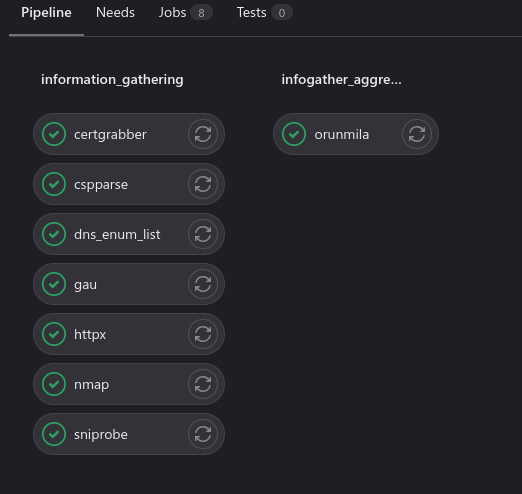
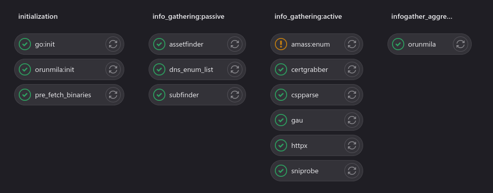

# My bugbounty journal day: 6 - GOTO DAY 5
- [My bugbounty journal day: 6 - GOTO DAY 5](#my-bugbounty-journal-day-6---goto-day-5)
  - [Plan for the day](#plan-for-the-day)
  - [Targets of the day](#targets-of-the-day)
  - [Tools of the day](#tools-of-the-day)
  - [Observations \& Conclusions of the day](#observations--conclusions-of-the-day)
  - [Final words](#final-words)

[WIP]: This is still being worked on :D

Alright, today i feel a lot better, the fever is gone and the headache is now a lot smoother (but still present). I tried to cleanup some of my notes but it was hard to recall what happened :rofl:

Hours on it: ~2am - ~8am

## Plan for the day
I started the day determined to make the tools that i was needed the day before. I hacked together snippets from all over the internet and put together 3 very simple tools:
* **`certnames`**: Parse a x509 PEM certificate and display Subject and/or DNS names with optional dns resolution of those alternative names
* **`cspparse`**: Connect to a given URL and parse the CSP server response header (if present) for URL schemes, hostnames and IP's
* **`sniprobe`**: Connect to a given TLS port and parse the remote end certificate for DNS names. For every name perform a get request pinned at the original hosts' IP. This makes SNI happy and is very different from simply changing the `HOST:` header.

At the start of the day the pipeline looked something like this

I also followed through and organized the automation pipelines into more clearcut stages, which so far are like this:
* **`initialization`**: Setting up any needed tools and files before the actual process starts
* **`info_gathering:passive`**: Information gathering stage with tools that dont access any of the targets' systems services
* **`info_gathering:active`**: Information gathering stage with tools that (at most) use a target system service but with minor "disturbance" (ie `GET /` or dns lookups using the targets dns servers etc)
* **`infogather_aggregation`**: This is an intermediate stage, it aggregates the information from all previous steps into an `orunmila.db` and makes all the artifacts from the previous steps available for a single download

This is how the pipeline looked like at the end of the day

The general plan for the day was
> ### `Follow up on the plan of Day 5` :rofl:

## Targets of the day
Since there was _a plan_, and i decided to follow it, it meant **no new programs**, just work on any of the past programs and try to keep notes of interesting findings.
I came across a lot of HubSpot instances this time around so i had to mess with it like any other application. Find their manuals and API references, check for endpoints and parameters. I was mostly trying to find endpoints that the application supports in hopes that some of them will be forgotten and unprotected.
My guess was right as i was able to find some endpoints for the usual user operations (register, signup, reset password, etc).

## Tools of the day
I was so excited about the prospect of integrating the new tools as well as `orunmila` in a more meaningful way, into the mix. I was even more surprised,
when the tools worked flawlessly and got integrated into my methodology without any pains :D

* `orunmila` for holding all my findings and interesting logs and then allowing me to pipe their output at different other tools
* `cspparse` for parsing csp policies and finding some extra domains that i was not able to find in any of my other scans
* `sniprobe` for probing SSL websites and listing domains that had interesting results (i loved error 530 from cloudflare :smiley: )

## Observations & Conclusions of the day
I merged these two together for this day since i was mostly focusing on evaluating my findings and doing some manual testing. I was able to cause a lot of application crash cases, which for me is a "good" sign that there is more to be found there. I have eliminated `amass` and `ffuf` as they were taking way to long to complete at this time and they need to be provided with a more carefully crafted dataset to produce meaningful results in a timely manner. I decided it would be best to be added on followup steps and on better curated datasets (that i would do my self).

The community has very few tools outside the obvious ones (sub domains and website searches). Tools for more specialized and better DNS enumerations seem to be few and tools for API's is mostly limited to zap and burp extensions.

## Final words
Everything went much better than expected and i felt really pumped with my newly polished Gitlab pipeline. I had interesting results and was able to add a few more "knowledge" to my notes.

I kept on thinking that i am 6 days into my BugBounty journey and have started 5 tools already (steadily eyeballing on the 6th), the way i go i'll be lost in a sea of projects soon :rofl:

- [day 7](day7.md)
- [Go back HOME](../)
- [day 5 - the best laid plans often go... to waste](day5.md)