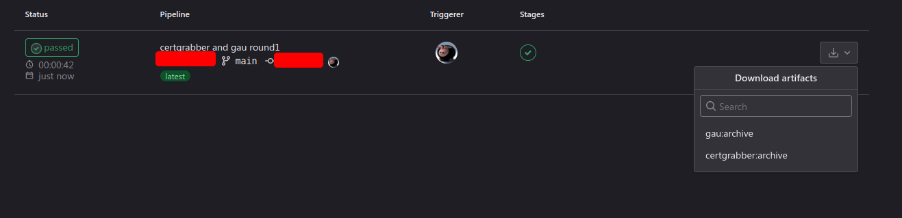

# My bugbounty journal day: 4 - lets use some more tooling
- [My bugbounty journal day: 4 - lets use some more tooling](#my-bugbounty-journal-day-4---lets-use-some-more-tooling)
  - [Plan for the day](#plan-for-the-day)
  - [Back to some old targets](#back-to-some-old-targets)
  - [Tools of the day](#tools-of-the-day)
  - [Observations of the day](#observations-of-the-day)
  - [Conclusions of the day](#conclusions-of-the-day)
  - [Final words](#final-words)

I'm still not fully recovered (flu wise), so i just want to push my self to make any progress possible since i know the next time i'll be able to touch these again will be (you guessed it, next week).

Hours on it: ~1:30am - ~4:20am

## Plan for the day
I'll take it slow and just try to use some more tools that i didnt have the time yesterday. As a friend suggested (thnx @g0rchy), i may push through the targets that i discovered yesterday even though there is no bounty. This will help in improving my workflow a bit as well as do some more progress on the next stage of tools that i will be using down the road. Not sure yet, i may do that.

I will also take a look at some of the other programs that i touched in the past maybe some of them will have a different vibe this time around :smiley:

I want to use some more tools today like `nuclei` and `xray` as i really like the ability to write your own tests. We'll see how this will go

## Back to some old targets
So i went back at some of the programs that i started with to try and test my _refined_ set of pipelines and see if i can add some extra steps and tools into the pipelines.

I ended up spending most of the day searching for some tooling to use not managed to implement any pipelines with `nuclei` & `xray` after all.

During my audit of the targets i came to the realization that i wanted a very specific set of words to try for my ffuf fuzzing. And although i came across the very useful lists of project Assetnote, they were still kinda huge for my liking. Out of this necessity the project [Orunmila](https://github.com/proditis/orunmila) was born :facepalm:

## Tools of the day
The following are not tools that i used but rather tools that resources that i needed to prepare better for the next engagement (dont laugh)

* https://github.com/assetnote/batchql GraphQL security auditing script with a focus on performing batch GraphQL queries and mutations
* https://github.com/nikitastupin/clairvoyance Obtain GraphQL API Schema even if the introspection is not enabled
* https://gitlab.com/dee-see/graphql-path-enum Tool that lists the different ways of reaching a given type in a GraphQL schema.
* https://bbva.github.io/apicheck/ APICheck is an environment for integrating existing HTTP APIs tools and create execution chains easily
* https://github.com/s0md3v/Arjun HTTP parameter discovery suite.
* https://github.com/SmartBear/soapui SoapUI is a free and open source cross-platform functional testing solution for APIs and web services.

The tools of the day where
* `httpie` which allowed me very easy to play with API endpoints
* `ffuf` damn this tool is good... But i need to find a way to make a bit more silent.

## Observations of the day

* I found it hard to believe that there was no tool to help in tagging wordlists and reducing their overall side/footprint? In any case until i find one, a friend and I thought about starting a project just for that. It has nothing yet as far as code goes, but we plan on pushing the first "version" soon.
* During this and my previous tests i had the need (more than once) for a way to grab the headers from requests. Now `httpie` and `curl` both support this but only for known endpoints. What was needed was a tool like `ffuf` that will keep the headers returned from requests based on specific criteria (ie log server headers if `Server:` header is not `nginx`)

## Conclusions of the day
I still have a lot of way to go to get familiar with a lot of tools prior. In every step of the way i couldnt stop but thinking that we need to create targets on the platform for users to test and familiarize with the different tools. A good example of this is `ffuf` which provides a host to test some options.

* It has been decided that a new tool will be created for the wordlists management and generation https://github.com/proditis/orunmila
* Try more than 1 HTTP methods both to existing and nonexisting domains, the results some times will surprise you

## Final words
I admit this day didnt have the progress i was hoping for but it was to be expected, during the day i started to develop high fever, at which point my performance and focus disappeared.

At around 4:10 i stopped playing with the program targets and started the cleanups. This included any documentation that i needed to update based on my latest findings and copy any new pipelines that i developed to be shared with the community :D

- [day 5](day5.md)
- [Go back HOME](../)
- [day 3](day3.md)